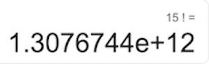
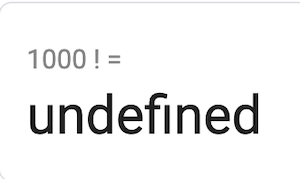
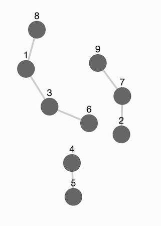
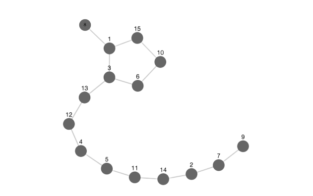
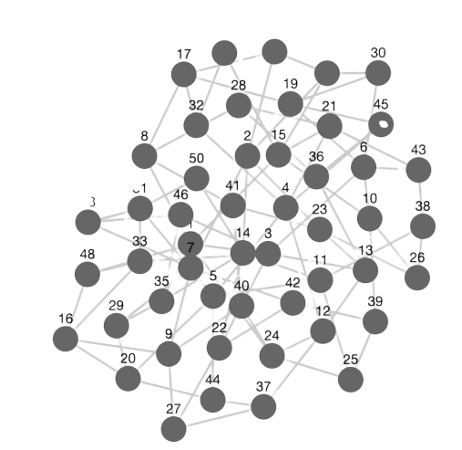
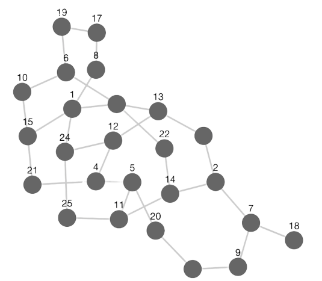

# The Square Sums Problem

I recently encountered a problem in CodeWars that took some time to figure out, so I decided to write about my experience solving it. I wrote the solution in Python, but my solution can be easily implemented in any number of languages.

## The Problem

### Link to Problem

[Square sums](https://www.codewars.com/kata/5a667236145c462103000091)

### Description from CodeWars

Write a function 'square sums' that, given an integer number _N_ (in range 2..1000), returns array of integers 1.._N_ arranged in a way, so sum of each 2 consecutive numbers is a square.

**Solution is valid if and only if following two criteria are met:**

- Each number in range 1.._N_ is used once and only once.
- Sum of each 2 consecutive numbers is a perfect square.

#### Example

For _N_ = 15 solution could look like this:  
[ 9, 7, 2, 14, 11, 5, 4, 12, 13, 3, 6, 10, 15, 1, 8 ]

- All numbers are used once and only once. When sorted in ascending order array looks like this:  
  [ 1, 2, 3, 4, 5, 6, 7, 8, 9, 10, 11, 12, 13, 14, 15 ]

- Sum of each 2 consecutive numbers is a perfect square:

  &nbsp;&nbsp;&nbsp;16&nbsp;&nbsp;&nbsp;&nbsp;&nbsp;&nbsp;16&nbsp;&nbsp;&nbsp;&nbsp;&nbsp;&nbsp;16&nbsp;&nbsp;&nbsp;&nbsp;&nbsp;&nbsp;16&nbsp;&nbsp;&nbsp;&nbsp;16&nbsp;&nbsp;&nbsp;&nbsp;&nbsp;&nbsp;16&nbsp;&nbsp;&nbsp;&nbsp;&nbsp;&nbsp;16  
   &nbsp;&nbsp;&nbsp;/+\ &nbsp;&nbsp;&nbsp;&nbsp;/+\ &nbsp;&nbsp;&nbsp;&nbsp;/+\ &nbsp;&nbsp;&nbsp;&nbsp;/+\ &nbsp;&nbsp;&nbsp;&nbsp;/+\ &nbsp;&nbsp;&nbsp;&nbsp;/+\ &nbsp;&nbsp;&nbsp;&nbsp;/+\  
   [ 9, 7, 2, 14, 11, 5, 4, 12, 13, 3, 6, 10, 15, 1, 8 ]  
   &nbsp;&nbsp;&nbsp;&nbsp;&nbsp;&nbsp;&nbsp;&nbsp;\\+/ &nbsp;&nbsp;&nbsp;&nbsp;\\+/ &nbsp;&nbsp;&nbsp;&nbsp;\\+/ &nbsp;&nbsp;&nbsp;&nbsp;\\+/ &nbsp;&nbsp;&nbsp;&nbsp;\\+/ &nbsp;&nbsp;&nbsp;&nbsp;\\+/ &nbsp;&nbsp;&nbsp;&nbsp;\\+/  
   &nbsp;&nbsp;&nbsp;&nbsp;&nbsp;&nbsp;&nbsp;&nbsp;&nbsp;9&nbsp;&nbsp;&nbsp;&nbsp;&nbsp;&nbsp;&nbsp;25&nbsp;&nbsp;&nbsp;&nbsp;&nbsp;&nbsp;9&nbsp;&nbsp;&nbsp;&nbsp;&nbsp;&nbsp;25&nbsp;&nbsp;&nbsp;&nbsp;&nbsp;&nbsp;&nbsp;9&nbsp;&nbsp;&nbsp;&nbsp;&nbsp;25&nbsp;&nbsp;&nbsp;&nbsp;&nbsp;&nbsp;&nbsp;9

  9 = 3*3  
   16 = 4*4  
   25 = 5\*5

If there is no solution, return False. For example if _N_ = 5, then numbers 1,2,3,4,5 cannot be put into square sums row: 1 + 3 = 4, 4 + 5 = 9, but 2 has no pairs and cannot link [1,3] and [4,5]

_Hint:_ if execution of the function takes more than 100 ms, you might want to try something else: there are >200 tests, and you have only 12 seconds.
**(This is Very Important)**

### Problem Translation

Lets break this description down a bit. First, lets think about the problem as a puzzle, rather than a challenge of Computer Science. Essentially, you are given all the numbers from 1 all the way up to a specific number, and need to arrange them in such a way to where each adjacent number adds up to a perfect square.

## Attacking The Problem at First

Again, lets stay away from Computer Science for now. How can we solve this problem at the most basic level? Once we are able to solve the problem, then we can worry about improving it.

One way to think about the problem would be to find all possible permutations of the numbers ranging from 1 to _N_, and to find the one(s) that contain this desired pattern. This means that we will try every possible arrangement of numbers from 1 to _N_ to see if any follow this 'square sums' pattern. If no arrangement contains this pattern, we can confidently say that it doesn't exist.

Lets try it! Here is the python3 translation:

```python
from itertools import permutations


def square_sums(num):
    perms = list(permutations([n for n in range(1, num+1)]))
    for perm in perms:
        if all([
            (n + perm[e])**.5 % 1 == 0
            for e, n in enumerate(perm[:-1], 1)
        ]):
            return perm
    return False
```

Basically, we are creating a list of all permutations of numbers in a range from 1 to _N_, and then iterating through each permutation to see if it follows the 'square sums' rule. If it does, return that specific instance. If none do, we return False.

The code is short and sweet! However, we can quickly see that this approach has some problems:

1. It is fairly difficult to come up with all possible permutations of numbers spanning from 1 to _N_ quickly.
2. The number of permutations of a number _N_ is _N!_.

Both of these points have one thing in common: It is **costly** in terms of time and memory to create all possible permutations of numbers and sort through them, whether it is a human or computer. This is especially true for values of _N_ over 50.

I tried running this code with a small value of 15, and it still timed out! However, that makes a ton of sense:



We would have to go through **that** many sequences just to find a single path, and this is just for N = _15_! For this problem, we need to accept values up to 1000, and run over 200 tests in less than 12 seconds. Seems daunting with our solution now. And as a friendly reminder:



## Thinking about the Problem Differently

I think by now you have realized that in order to create an algorithm that will solve this problem up to _N_ = 1000 **quickly**, we need to do much, much better.

> But before I continue, I encourage you to try and solve this problem by hand. Try a small number (15) at first. You don't have to solve the problem either. As it turns out, just attempting the problem by hand can lead to some valuable insights on how to solve the problem for real.

Realistically, instead of coming up with every permutation of numbers from 1 to _N_, we would choose a starting point, and keep choosing numbers that would fulfill the 'square sums' pattern when added to the previous number. For example, for _N_ = 15, we would choose 1 as our starting point, and then add 3 (1 + 3 = 4), and then add 6 after that (3 + 6 = 9), and so on, choosing each number at random if it fulfills the pattern. If we run out of numbers that would add up to a square (and we haven't used all 15 numbers), we would need to choose a different starting point and try again. If we run out of starting points, we would say that the pattern doesn't exist for that _N_. If you attempted the exercise above, you might have tried this strategy first.

Now here's the thing with this strategy: _not every starting point works._ For instance, when _N_ = 15, there is not a single solution with 1 as a starting or ending point. You are welcome to try it out. 1 is needed to bridge the gap of adjacent squares somewhere else, and is too important of a number to be only connected once.

This begs a few questions: Are some numbers more important than others when solving this problem? What about **sequences** of numbers?

Here's an idea: let's represent this problem as a graph, with the numbers 1-_N_ as vertices, and edges between numbers existing _only if they add up to a square_. This way, we are determining the list of numbers that can 'pair up' with another number. If we draw out this graph, we can definitively see that some numbers are more important than others when attacking this problem. We might also make a breakthrough as well!

Let's test the idea first. Here's the graph for _N_ = 9:



The graph visualizes the problem very well! 1 connects to 3 but also to 8; 3 connects to 1 but also to 6; etc. We can **also** see that 9 doesn't work for this problem because we cannot connect all of the numbers together in one path.

Sweet! Now lets try a slightly bigger number. Here's the graph for _N_ = 15:



We can see that _N_ = 15 works with only a single path! No longer do we have to sort through hundreds of millions of permutations- we can now just follow the edges between numbers to construct a path.

What we have just done is redefined the problem completely, and made it **extremely** more efficient. We have translated the problem from guessing and checking sequences to traversing a graph and finding a path that visits every node exactly once. This new problem has a name: we wish to find a [Hamiltonian Path](http://mathworld.wolfram.com/HamiltonianPath.html) in our graph.

## Implementing the Hamiltonian Path

We are making good progress on this problem! Although computationally intensive, finding a Hamiltonian Path in our graph solves our problem, and does much better than our older approaches (note that, worst case, you must go through each path in a graph to find a Hamiltonian Path).

Here is the python3 translation:

```python
def square_sums(num):
    graph = create_graph(num)
    if not graph:
        return False

    for vertex in graph:  # Choose each vertex as a starting point, until Hamiltonian Path is found
        parents = []
        result = dfs(vertex, graph, parents, num)
        if result:
            return result

    return False

# Helper Functions
'''
    Create a Graph of Vertices (Numbers) and Edges (Links Between Numbers)
        -> We are making an adjacency list
'''
def create_graph(num):
    squares = set([item ** 2 for item in range(1, 2*num)])
    graph = {}

    # Populate the Graph (O(n^2))
    for vertex in range(1, num+1):
        adj_list = []
        for edge in range(1, num+1):

            # have to add up to a square, cannot connect with itself
            if vertex + edge in squares and vertex != edge:
                adj_list.append(edge)

        if len(adj_list) == 0:
            return False
        graph[vertex] = adj_list

    return graph


'''
    To Find the Singular Path, we are using a version of Depth First Search
        -> Instead of marking "discovered" nodes, we keep track of a list of parent nodes
'''
def dfs(edge, graph, parents, num):
    new_list = parents + [edge]
    if len(new_list) == num:
        return new_list

    adj_nodes = [adj_node for adj_node in graph[edge]
                 if adj_node not in new_list]  # Filter Out Already Visited Nodes from Graph/Adj List

    for node in adj_nodes: # Recursively call DFS on all Adj_Nodes until Hamiltonian Path is found
        result = dfs(node, graph, new_list, num)
        if result:
            return result
```

I'll break the code down below.

> In order to find a Hamiltonian Path, we must first create the graph. We represent the graph as an adjacency list (dictionary in python), where each 'key' is a vertex/number and each 'value' is a list of vertices that 'pair' with that number. Remember, we only pair two numbers if they add up to a square. We will use each vertex in the graph as a starting point to find our Hamiltonian Path. The heavy lifting is done in the dfs method. Here, we perform a recursive implementation of Depth First Search. At each function call, we 'visit' a specific vertex, add it to a list of visited vertices, and perform dfs on all adjacent vertices that have not already been visited. Note: this is a brute force solution that checks each path that exists in the graph.

So.... we're done, right? Well, not really. This solution may be much faster, but it is no where near _N_ = 1000 levels. Let's test the performance using the timeit module.

| _N_ | Trials | Average Time per Trial (s) |
| --- | :----: | -------------------------: |
| 15  |  1000  |              0.00018250654 |
| 20  |  1000  |             0.001566397204 |
| 30  |  1000  |       0.043062858594000004 |
| 40  |  1000  |             0.787779116778 |
| 50  |   10   |             302.9348414185 |

Yes, it literally took 302 seconds to compute _N_ = 50.

I snubbed the number of trials for _N_ = 50 because it would have taken a stupid amount of time. Regardless, as _N_ increases, the average time it takes to solve the square sums problem increases seemingly exponentially. The > 200 tests would fail if we were testing up to _N_ = 50 according to these results, not to mention our task of _N_ = 1000. So, why is it taking this long to begin with? What's with the discrepancy between _N_?

As I mentioned in the code explanation, we are using a brute-force approach to graph traversal. Right now, we are testing _every_ possible path between nodes, starting with an arbitrary vertex. This works fine when _N_ is < 50; however, values of _N_ beyond that make the solution basically useless.

Take the graph of _N_ = 15, from above:


When you start from vertices 8 or 9, there are only two paths you can choose from! For example, when starting at the 8, the only decision we have to make is to go to the 3 or 15 from the 1. This makes finding the solution very fast. In addition, if we choose vertex 1 to start, we only have to check three paths. In other words, if we choose the incorrect vertex, we won't be dealing with that error for very long.

Now take the graph of _N_ = 50:



As _N_ gets bigger, we can see that the number of decisions we have to make dramatically increases, whether that is starting at a specific vertex, or moving to a specific vertex from another. That is, the number of available paths exponentially increases as _N_ increases. We cannot go through every possible path if we wish to tackle the _N_ = 1000 problem. Much like the permutation idea, brute force does not work forever.

## We Need to Do Even Better

Time to ramp it up. If we need to do better, we need to start recognizing some patterns in those graphs we drew out earlier.

### Making it Linear

Let's first think about the starting vertex. If we can figure that one out, we can at least cut down the problem size by a factor of _N_. Again, go back to _N_ = 15. How would we know where to start? Intuitively, you would start at the ends of the graph; here, the Hamiltonian Path starts only at the 8 or 9. In other words, the best place to start would be the place with the fewest number of connections.

As it turns out, this idea is true! We cannot start at, say, 1 because 1 is too important in connecting the rest of the graph together. We will start at 8 and 9, and if no Hamiltonian Path exists starting with them, no path exists at all. You can check for yourself using [Jack Morris's Graph Creation Tool](http://jackxmorris.com/posts/square-sum).

The problem is, the real bulk of the computation is done when _deciding_ on which node to travel to. Fortunately for us, this decision follows the same invariant as above: **You Choose The Node With The Minimum Number of Adjacent Nodes Left**. If the decision is between two nodes with the same number of remaining adjacent nodes, pick at random.

> Note: You must take into account the visited nodes when determining the remaining adjacent nodes. i.e. an adjacent node cannot be a parent node.

We will look at one last graph to confirm. Lets look at _N_ = 25:



We will start at 18 (this number only has one connection) and will move on to 7 (since we have no other options). From here, we will choose 9 instead of 2, because 9 has one other adjacent node while 2 has two others. Repeat this decision pattern until you reach the end!

Let's translate into python3:

```python
import sys
sys.setrecursionlimit(1500)

def square_sums(num):
    graph = create_graph(num)
    root_node = min(graph.keys(), key=(lambda v: len(graph[v]))) # Choose Node With Least # of Adj Nodes
    result = dfs(root_node, graph, [], set(), num)
    return result if result else False

'''
    Create a Graph of Vertices (Numbers) and Edges (Links Between Numbers)
        -> We are making an adjacency list
'''
def create_graph(num):
    squares = set([item ** 2 for item in range(1, 2*num)])
    graph = {}

    # Populate the Graph (O(n^2))
    for vertex in range(1, num+1):
        adj_list = []
        for edge in range(1, num+1):

            # have to add up to a square, cannot connect with itself
            if vertex + edge in squares and vertex != edge:
                adj_list.append(edge)

        if len(adj_list) == 0:
            return False
        graph[vertex] = set(adj_list)

    return graph


'''
    To Find the Singular Path, we are using a version of Depth First Search
        -> Instead of marking "discovered" nodes, we keep track of a list of parent nodes
'''
def dfs(edge, graph, parents, set_parents, num):
    new_list = parents + [edge]
    new_set = set_parents.copy()
    new_set.add(edge)
    if len(new_set) == num:
        return new_list

    adj_nodes = [tuple((adj_node, graph[adj_node] - new_set))
                 for adj_node in graph[edge] - new_set]

    for node, _ in sorted(adj_nodes, key=lambda tup: len(tup[1])):
        result = dfs(node, graph, new_list, new_set, num)
        if result:
            return result
```

> I'm not going to say too much about this code, because it is very similar to the implementation above. The big changes are: I use an adjacency list of python sets instead of python lists, The starting vertex has the least # of adj nodes, and I sort any vertex's adjacent nodes by the minimum number of adjacent nodes left in dfs. Additionally, I added the parameter 'set_parents' to dfs, which is the set representation of 'parents'. This just makes it easier to filter out visited nodes from any vertex's adjacent nodes.

Now let's test the performance!

| _N_  | Trials | Average Time per Trial (s) |
| ---- | :----: | -------------------------: |
| 15   |  1000  |              6.5710885e-05 |
| 20   |  1000  |             0.000192876566 |
| 30   |  1000  |             0.000204163948 |
| 40   |  1000  |             0.005209273411 |
| 50   |  1000  |      0.0009380500220000001 |
| 100  |  1000  |      0.0036707946050000004 |
| 200  |  1000  |      0.0035643807719999998 |
| 500  |  1000  |              0.02462741449 |
| 1000 |  1000  |        0.10473925598099999 |

This is **significantly** better than the brute force algorithm we were working with earlier! Right now, we are dealing with a worst case, .105s average runtime speed, which is incredibly fast! I can almost see the green check mark for the 1 Kyu Problem :D

### Speeding Up Graph Creation

Unfortunately, CodeWars wants the solution to be _slightly_ faster, so we need to squeak out a little more performance. Ironically, the dominant cost has shifted from graph traversal to graph creation (for higher numbers). See for yourself below; the rightmost column is just the data from above.

| _N_  | Trials | Average Time per Graph Creation (s) | Average Total Time (s) |
| ---- | :----: | ----------------------------------: | ---------------------: |
| 15   |  1000  |               5.511529599999999e-05 |          6.5710885e-05 |
| 20   |  1000  |                       5.6879156e-05 |         0.000192876566 |
| 30   |  1000  |               9.958225999999999e-05 |         0.000204163948 |
| 40   |  1000  |              0.00014816969400000002 |         0.005209273411 |
| 50   |  1000  |              0.00020586508599999996 |  0.0009380500220000001 |
| 100  |  1000  |                      0.000691168632 |  0.0036707946050000004 |
| 200  |  1000  |                      0.002400978248 |  0.0035643807719999998 |
| 500  |  1000  |                       0.01804599503 |          0.02462741449 |
| 1000 |  1000  |                 0.07171780046899999 |    0.10473925598099999 |

At the top of my head, I couldn't think of an algorithmically faster way to create the graph. I needed to check, for each vertex, if adding the vertex to each of the other vertices would yield a square number. No getting around that obstacle.

What I did know was that I only needed, at worst case, a graph for _N_ = 1000. So instead of creating a graph for _N_ = 1000, I would hard code the graph, and exclude any values I didn't need. For example, if _N_ = 100, I would take my hard coded graph of _N_ = 1000, and would exclude all vertices from _101_ to _1000_. Additionally, I would remove all adjacent nodes from _101_ to _1000_ from the vertices that I kept in the graph. This was the final push I needed to solve this problem.

## Final Product and Performance

### Python3 Code

```python
import sys
sys.setrecursionlimit(1500)

def square_sums(num):
    graph = create_graph(num)
    root_node = min(graph.keys(), key=(lambda v: len(graph[v])))
    result = dfs(root_node, graph, [], set(), num)
    return result if result else False


def dfs(edge, graph, parents, set_parents, num):
    new_list = parents + [edge]
    new_set = set_parents.copy()
    new_set.add(edge)
    if len(new_set) == num:
        return new_list

    adj_nodes = [tuple((adj_node, graph[adj_node] - new_set))
                 for adj_node in graph[edge] - new_set]

    for node, _ in sorted(adj_nodes, key=lambda tup: len(tup[1])):
        result = dfs(node, graph, new_list, new_set, num)
        if result:
            return result

def create_graph(num):
    # d = {Long Dictionary Can Be Found Here: https://github.com/wyatt00/CodeWars/blob/master/1%20kyu/square_sums.py}
    exclude = set([x for x in range(num + 1, 1001)])
    graph = {}

    for vertex, l in d.items():
        if vertex in exclude:
            continue
        graph[vertex] = l - exclude
    return graph
```

### Performance Table

| _N_  | Trials | Average Time per Trial (s) |
| ---- | :----: | -------------------------: |
| 15   |  1000  |             0.001188365019 |
| 20   |  1000  |             0.001306149222 |
| 30   |  1000  |             0.001271471515 |
| 40   |  1000  |               0.0062256103 |
| 50   |  1000  |      0.0018437314870000002 |
| 100  |  1000  |             0.004198765113 |
| 200  |  1000  |             0.002927683286 |
| 500  |  1000  |             0.007946864877 |
| 1000 |  1000  |             0.031307859218 |

In comparison, the final product is much better for higher values of _N_ and slightly worse for lower values.

## Special Thanks

- A huge thank you to Matt Parker (Numberphile), who inspired me to solve and write this. He also helped me break down the problem in his 'Square-Sum Problem' YouTube Video:

  [](https://www.youtube.com/watch?v=G1m7goLCJDY)

- A special thanks to Jack Morris for his awesome graph visualizer! This, and his own breakdown to this problem can be found [here](http://jackxmorris.com/posts/square-sum).
